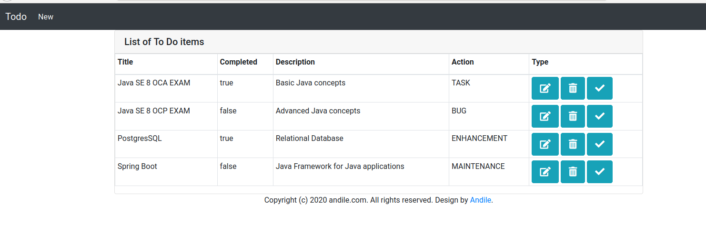
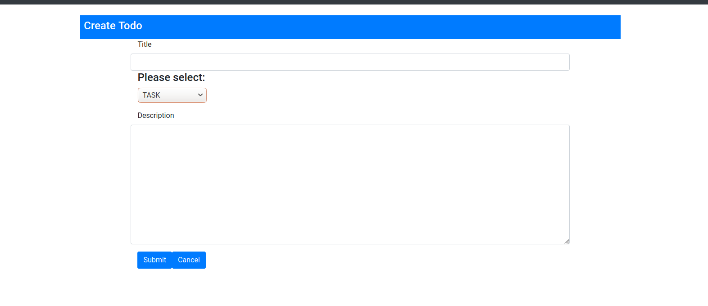
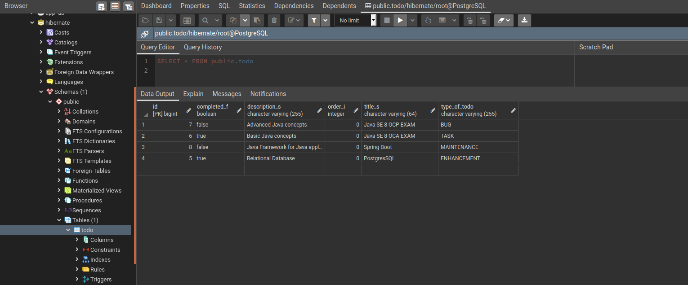

# Todo Application

## Requirements

Java 8 or later installed.
Docker or MySQL installed.

## Running

### Start MySQL

The docker-compose file in `src/main/docker/mysql.yml` provides a default database, user and password for the application to use.

Linux:

```bash
./run-mysql.sh
```
Windows:
```cmd
run-mysql.cmd
```

### Build and Run Application
```
./mvnw package
java -jar ./target/todo-0.0.1-SNAPSHOT.jar
```

OR launch from IDE

Then visit http://localhost:8081
-Home page with the Todo items

- Create page with the drop-down box


- Todo items stored in the PostgresSQL database 

